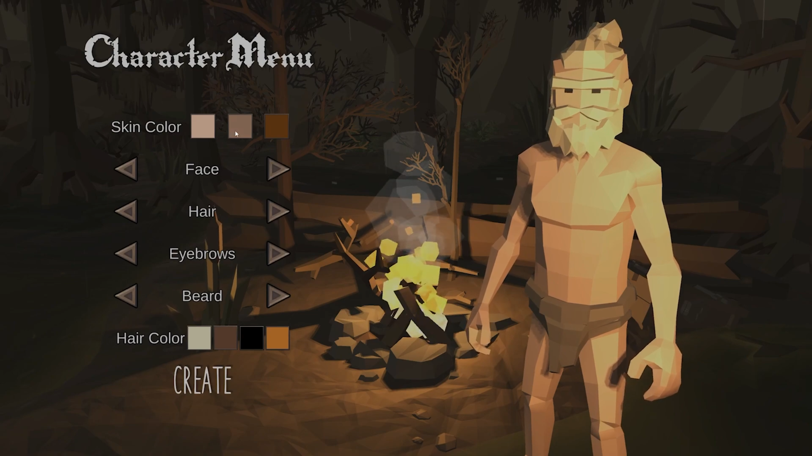
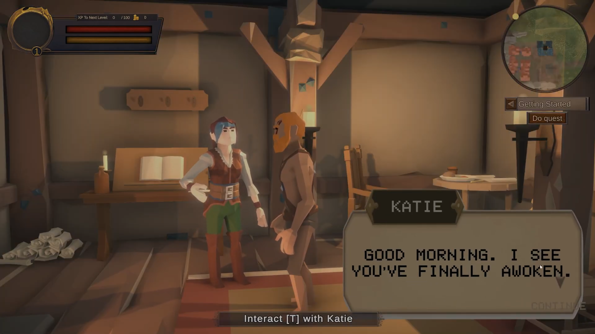
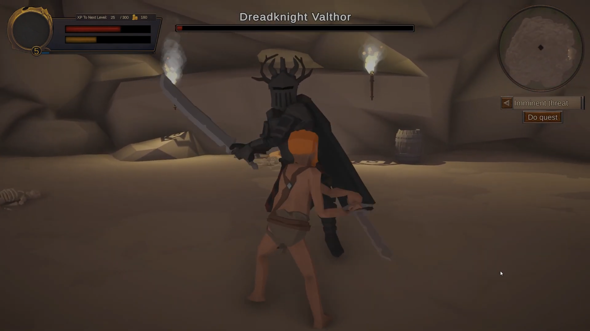

# Battle of Aradathia

🏰 Welcome to Battle of Aradathia

Battle of Aradathia is an immersive RPG set in a fantasy world filled with adventure, enemies, and fun quests. Build your character, interact with NPCs, engage in thrilling combat, and save Aradathia from dangerous creatures!

##  Features  

- **Character Creation** – Customize your character appearances.  
- **NPC Interaction** – Engage with the world through conversations and quests.  
- **Combat System** – Fight against enemies in engaging battles that test your strategy and skill.  
- **Exploration** – Discover a vast world filled with quests, secrets, and challenges.

## Screenshots

**Character Creation**

Currently the character creation is only cosmentic. Abilities and clothing can be customizes in the game.

**NPC Interactions**

Speak with townsfolk to get an idea of the current state of Aradathia. Some of them will present quests that will reward you and save Aradathia.

**Boss Fight**

There are two bosses that must be defeated to save aradathia. In addition to these there are other enemies. The enemies have varying abilities.
